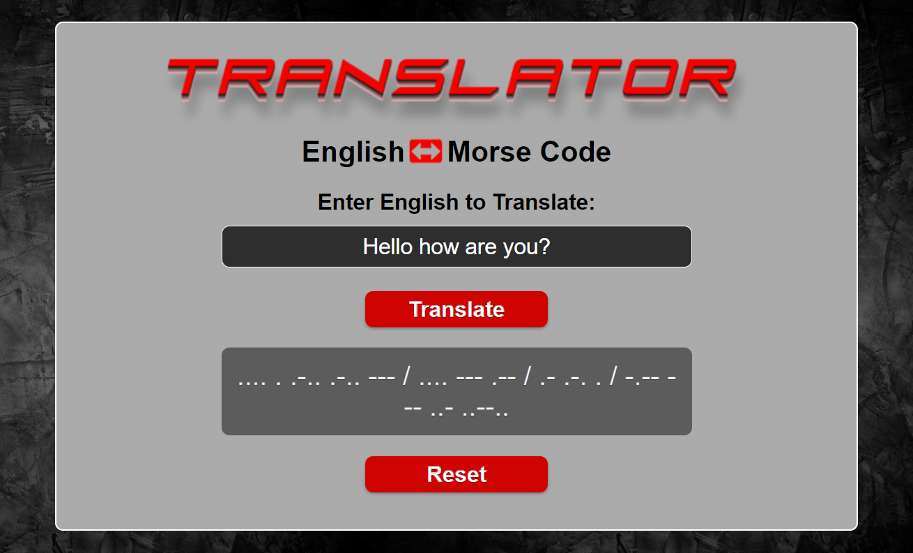
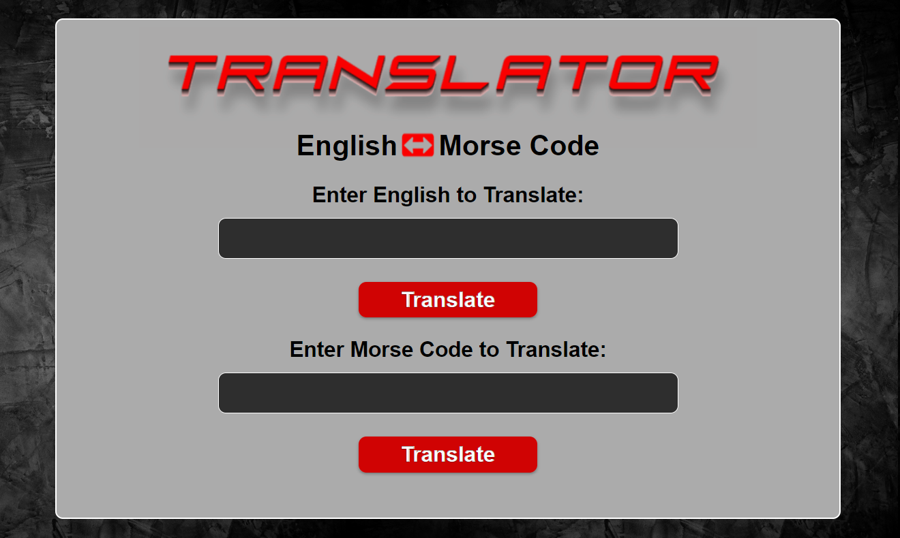

# Morse Code Translator

The Morse Code Translator is an intuitive application designed to effortlessly convert text between Morse code and English, facilitating seamless communication in both directions.

<p align="center">  
    
    <br>
    
</p>

## Built With

- HTML, CSS, JavaScript
- Visual Studio, Git & GitHub

### Running locally
To run this project, you only need a computer with a browser (like Google Chrome, Mozilla Firefox, Microsoft Edge, Apple Safari, etc.) installed, and follow these steps:

1. In your terminal, type the following, to clone this repository:

```sh
$ git clone https://github.com/AndrewRobertSpence/Morse-code-translator.git
```

2. After, run the following commands in your terminal:

```sh
$ cd Morse-code-translator
$ code .
$ npm install
```

3. After running live server from the HTML file, the application will render in the browser.

4. Or click here <a href="https://andrewrobertspence.github.io/Morse-code-translator/">Morse Code Translator</a>

## Author

👤 Andrew Spence

-GitHub: [AndrewRobertSpence](https://github.com/AndrewRobertSpence)<br>
-LinkedIn: [@Andrew-Spence](https://www.linkedin.com/in/andrew-spence-6b3b032a2/)

## Show your support

Give a ⭐️ if you like this project!